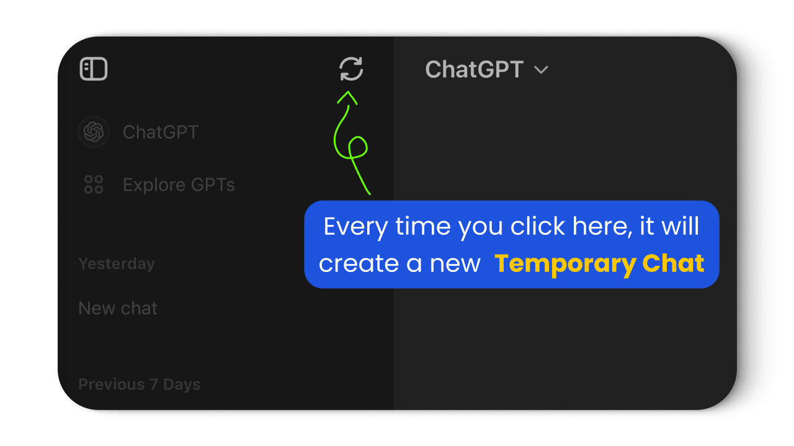

<p align="center">
  <a href="https://chromewebstore.google.com/detail/chatgpt-keep-temporary-ch/hgbjeckjcopbneknolackcedoknnkjpe" target="_blank">
    
  </a>
</p>
<h2 align="center" style="height: 23px">ChatGPT Chrome Extension</h2>
<h3 align="center">to keep enabled <b>Temporary Chat</b></h3>
<br>
<p align="center">
  <a href="https://chromewebstore.google.com/detail/chatgpt-keep-temporary-ch/hgbjeckjcopbneknolackcedoknnkjpe" target="_blank">
    
  </a>
</p>
<br />
<br />

### ✨ Found the extension helpful? You can support us by:
ko_fi: https://ko-fi.com/eliseinicolae  
Revolut: https://revolut.me/eliseinicolae

---

### For development.

- to create the zip, execute:
```
cd src
zip -r dist.zip *
```
